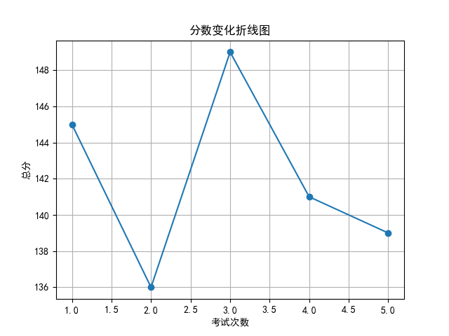
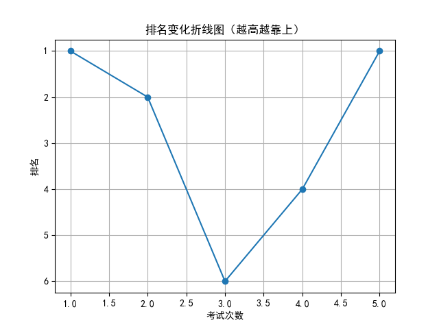

# 📄 学生考试报告：陈一诺
## 基本信息
- 学号：2024001
- 班级：高三 5班
- 性别：女
- 考试编号：第二学期 第五次考试
- 当前总分：139，当前排名：第1名
- 与上次相比，排名↑3名（从第4名到第1名），与第一次考试相比↓0名（从第1名到第1名）

## 错误题目与知识点
- 题目 16：导数的几何意义，由函数的极值求参数的取值范围
- 题目 17：余弦定理，线面垂直的判定与性质，二面角

## 历史分数与排名变化

## 💬 学习建议（由 AI 生成）
陈一诺同学，本次考试你继续保持领先，总分139，排名稳居第一，值得肯定。你在导数、立体几何等难点上仍存在失误，特别是“导数的几何意义”“由函数极值求参数”“余弦定理”“线面垂直与二面角”等知识点需加强巩固。建议针对性刷题，梳理错题本，强化薄弱环节。继续加油，保持优势，稳步提升！
