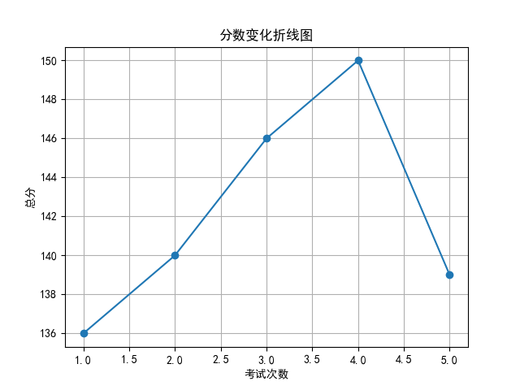
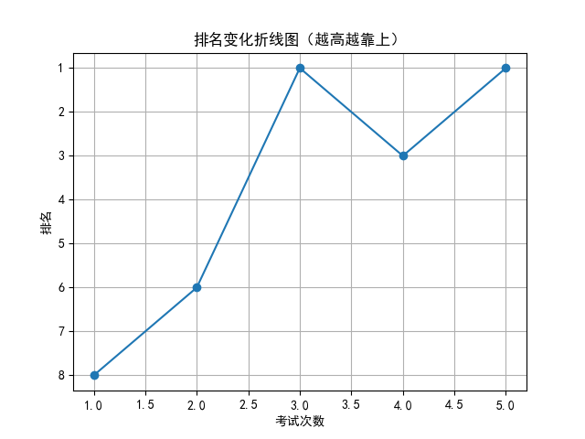

# 📄 学生考试报告：林欣怡
## 基本信息
- 学号：2024002
- 班级：高三 5班
- 性别：女
- 考试编号：第二学期 第五次考试
- 当前总分：139，当前排名：第1名
- 与上次相比，排名↑2名（从第3名到第1名），与第一次考试相比↑7名（从第8名到第1名）

## 错误题目与知识点
- 题目 16：导数的几何意义，由函数的极值求参数的取值范围
- 题目 17：余弦定理，线面垂直的判定与性质，二面角

## 历史分数与排名变化

## 💬 学习建议（由 AI 生成）
林欣怡同学，本次考试成绩为139分，排名稳居第一，整体表现优秀。但需关注导数几何意义、余弦定理及立体几何中线面垂直与二面角等知识点的掌握。建议加强典型题训练，查漏补缺，巩固薄弱环节，继续保持良好的学习状态。
