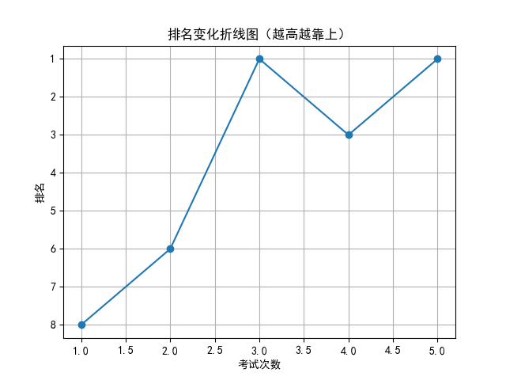

# 📄 学生考试报告：刘梓涵
## 基本信息
- 学号：2024003
- 班级：高三 5班
- 性别：女
- 考试编号：第二学期 第五次考试
- 当前总分：139，当前排名：第1名
- 与上次相比，排名↑2名（从第3名到第1名），与第一次考试相比↑7名（从第8名到第1名）

## 错误题目与知识点
- 题目 16：导数的几何意义，由函数的极值求参数的取值范围
- 题目 17：余弦定理，线面垂直的判定与性质，二面角

## 历史分数与排名变化

## 💬 学习建议（由 AI 生成）
刘梓涵同学，你本次考试继续保持第一，表现稳定。进步明显的是综合运用能力较强，但在导数几何意义、函数极值参数求解、余弦定理及立体几何相关知识点上仍存在薄弱环节。建议针对历史与本次错误点进行系统梳理，强化公式推导和典型例题训练，提升解题的准确性和熟练度。继续加油，保持优势，查漏补缺！
