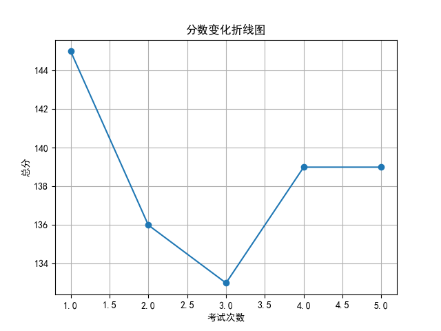
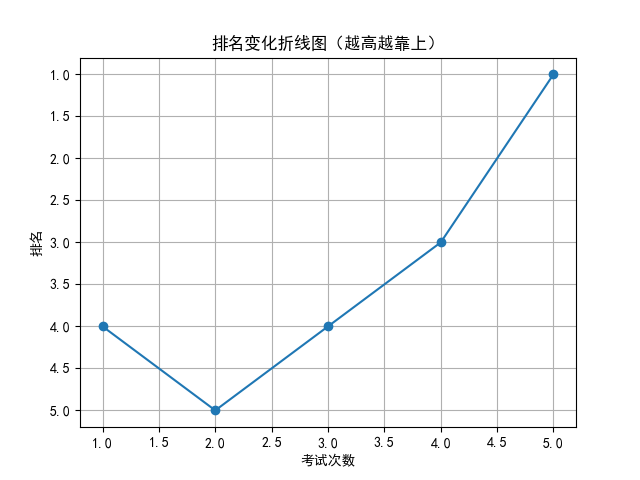

# 📄 学生考试报告：胡浩轩
## 基本信息
- 学号：2024004
- 班级：高三 5班
- 性别：男
- 考试编号：第二学期 第五次考试
- 当前总分：139，当前排名：第1名
- 与上次相比，排名↑2名（从第3名到第1名），与第一次考试相比↑3名（从第4名到第1名）

## 错误题目与知识点
- 题目 16：导数的几何意义，由函数的极值求参数的取值范围
- 题目 17：余弦定理，线面垂直的判定与性质，二面角

## 历史分数与排名变化

## 💬 学习建议（由 AI 生成）
胡浩轩同学，本次考试你以139分位列第一，成绩稳步提升，值得肯定。但在导数几何意义、极值求参数及立体几何（余弦定理、线面垂直、二面角）方面仍存在问题。建议加强对高频错题知识点的理解与练习，注重题型归纳和方法总结，查漏补缺，巩固基础，争取更大突破！
