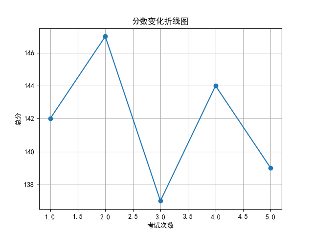
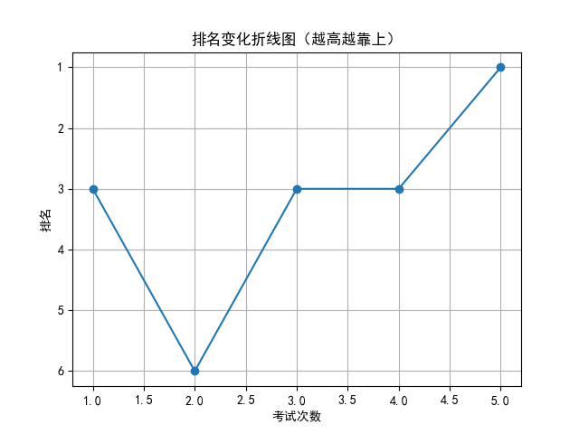

# 📄 学生考试报告：刘欣妍
## 基本信息
- 学号：2024005
- 班级：高三 5班
- 性别：女
- 考试编号：第二学期 第五次考试
- 当前总分：139，当前排名：第1名
- 与上次相比，排名↑2名（从第3名到第1名），与第一次考试相比↑2名（从第3名到第1名）

## 错误题目与知识点
- 题目 16：导数的几何意义，由函数的极值求参数的取值范围
- 题目 17：余弦定理，线面垂直的判定与性质，二面角

## 历史分数与排名变化

## 💬 学习建议（由 AI 生成）
刘欣妍同学，本次考试你以139分跃居年级第一，成绩稳步提升，表现出色！但需注意导数几何意义、函数极值求参数、余弦定理及立体几何中二面角等知识点仍存在问题。建议加强对综合题型的训练，巩固薄弱环节，注重知识间的联系与应用。继续保持积极态度，相信你会更上一层楼！
