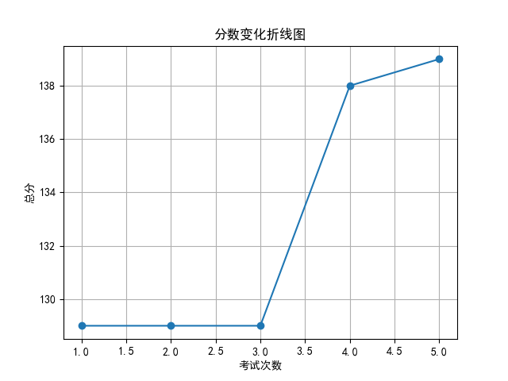
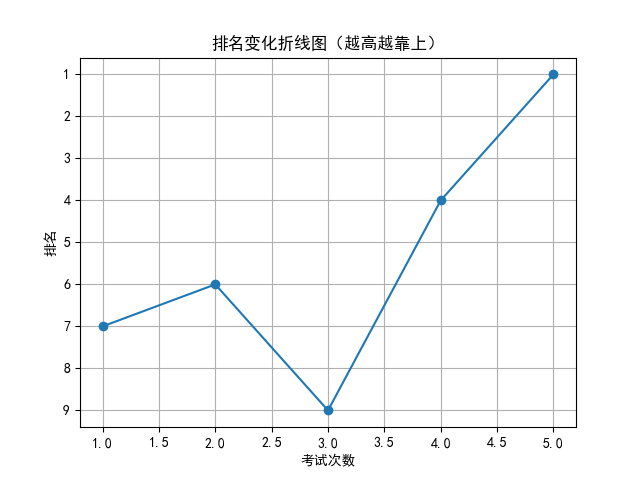

# 📄 学生考试报告：徐子轩
## 基本信息
- 学号：2024007
- 班级：高三 5班
- 性别：男
- 考试编号：第二学期 第五次考试
- 当前总分：139，当前排名：第1名
- 与上次相比，排名↑3名（从第4名到第1名），与第一次考试相比↑6名（从第7名到第1名）

## 错误题目与知识点
- 题目 16：导数的几何意义，由函数的极值求参数的取值范围
- 题目 17：余弦定理，线面垂直的判定与性质，二面角

## 历史分数与排名变化

## 💬 学习建议（由 AI 生成）
徐子轩同学，本次考试你取得了139分的好成绩，首次获得年级第一，进步显著，值得表扬！你在导数与立体几何方面仍存在薄弱点，如导数的几何意义、余弦定理和线面垂直相关问题。建议针对这些高频错题进行专项巩固，结合典型例题加深理解。继续保持良好的学习状态，查漏补缺，争取更上一层楼！
