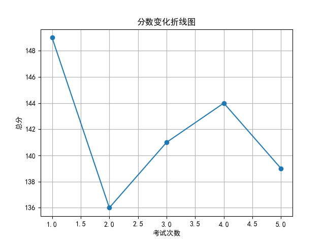
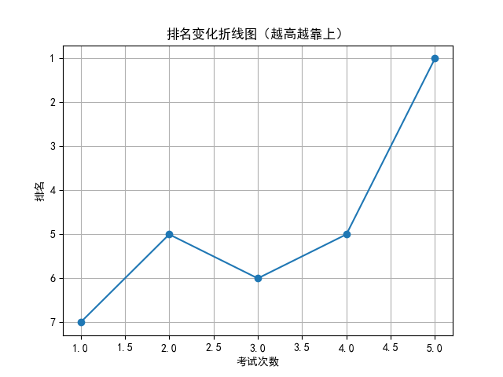

# 📄 学生考试报告：胡宇航
## 基本信息
- 学号：2024008
- 班级：高三 5班
- 性别：男
- 考试编号：第二学期 第五次考试
- 当前总分：139，当前排名：第1名
- 与上次相比，排名↑4名（从第5名到第1名），与第一次考试相比↑6名（从第7名到第1名）

## 错误题目与知识点
- 题目 16：导数的几何意义，由函数的极值求参数的取值范围
- 题目 17：余弦定理，线面垂直的判定与性质，二面角

## 历史分数与排名变化

## 💬 学习建议（由 AI 生成）
胡宇航同学，本次考试排名跃居第一，成绩稳步提升，值得肯定。但在导数几何意义、极值求参数及余弦定理等知识点上仍存在失误，建议加强相关题型的巩固训练，注重错题反思与归纳总结。继续保持良好状态，查漏补缺，争取更优异成绩！
