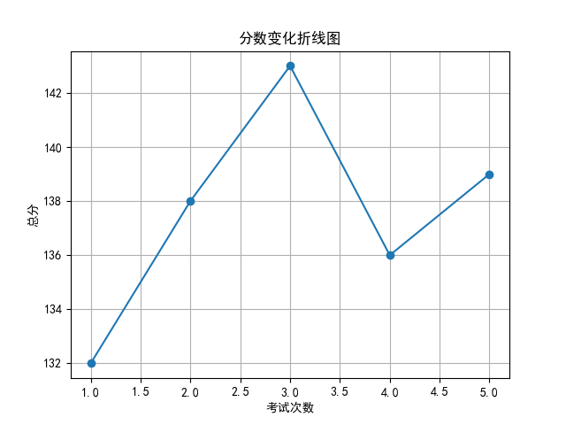
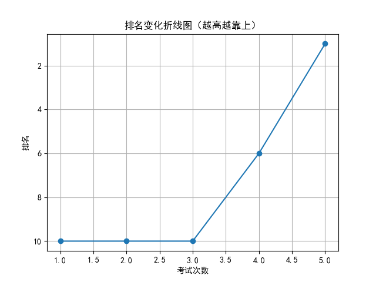

# 📄 学生考试报告：赵宇航
## 基本信息
- 学号：2024009
- 班级：高三 5班
- 性别：男
- 考试编号：第二学期 第五次考试
- 当前总分：139，当前排名：第1名
- 与上次相比，排名↑5名（从第6名到第1名），与第一次考试相比↑9名（从第10名到第1名）

## 错误题目与知识点
- 题目 16：导数的几何意义，由函数的极值求参数的取值范围
- 题目 17：余弦定理，线面垂直的判定与性质，二面角

## 历史分数与排名变化

## 💬 学习建议（由 AI 生成）
赵宇航同学，本次考试你以139分位列第一，进步显著，值得肯定。但需注意导数与立体几何相关知识点仍存在薄弱环节。建议加强对导数极值、几何意义及空间向量的复习，巩固解题思路。继续保持专注，查漏补缺，相信你会更上一层楼！
