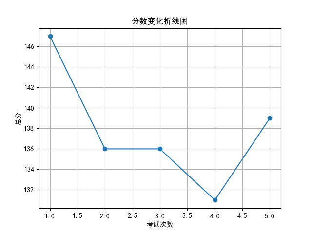
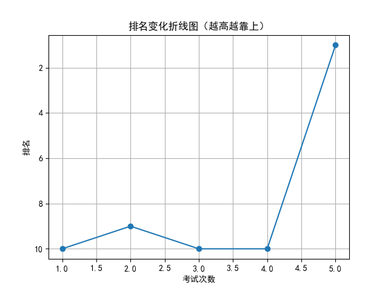

# 📄 学生考试报告：吴可馨
## 基本信息
- 学号：2024010
- 班级：高三 5班
- 性别：女
- 考试编号：第二学期 第五次考试
- 当前总分：139，当前排名：第1名
- 与上次相比，排名↑9名（从第10名到第1名），与第一次考试相比↑9名（从第10名到第1名）

## 错误题目与知识点
- 题目 16：导数的几何意义，由函数的极值求参数的取值范围
- 题目 17：余弦定理，线面垂直的判定与性质，二面角

## 历史分数与排名变化

## 💬 学习建议（由 AI 生成）
吴可馨同学，本次考试成绩139分，排名跃居第一，进步显著，值得表扬！你在解题思维和综合运用能力上有明显提升。但需注意导数几何意义、极值参数求解、余弦定理及立体几何中线面垂直与二面角的掌握仍需加强。建议针对薄弱知识点进行专项训练，强化逻辑推理和空间想象能力，持续巩固基础，稳步提升成绩。
