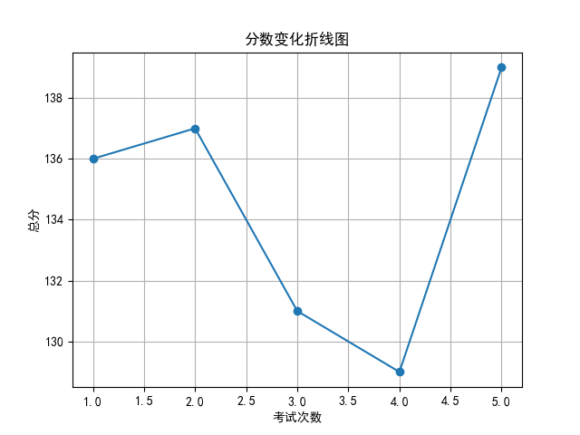
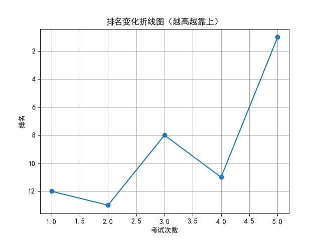

# 📄 学生考试报告：罗浩宇
## 基本信息
- 学号：2024011
- 班级：高三 5班
- 性别：男
- 考试编号：第二学期 第五次考试
- 当前总分：139，当前排名：第1名
- 与上次相比，排名↑10名（从第11名到第1名），与第一次考试相比↑11名（从第12名到第1名）

## 错误题目与知识点
- 题目 16：导数的几何意义，由函数的极值求参数的取值范围
- 题目 17：余弦定理，线面垂直的判定与性质，二面角

## 历史分数与排名变化

## 💬 学习建议（由 AI 生成）
罗浩宇同学，本次考试你取得了139分的好成绩，排名跃居第一，进步显著，值得表扬！但仍需关注导数与立体几何相关知识点的掌握，特别是导数的几何意义、极值求参数及二面角问题。建议针对薄弱点进行专项训练，巩固基础知识，提升解题灵活性。继续保持良好状态，争取更大突破！
