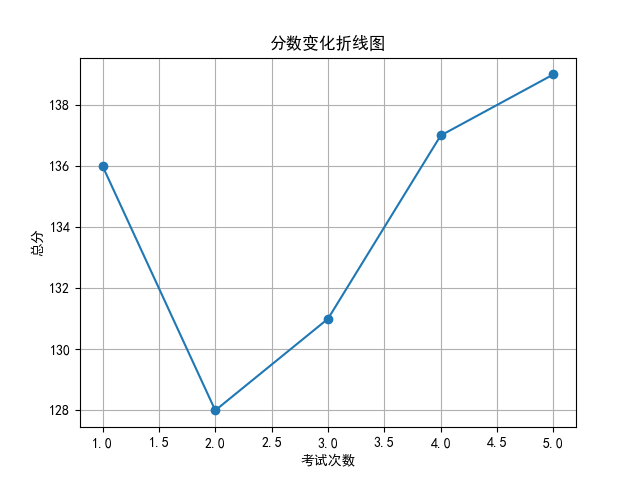
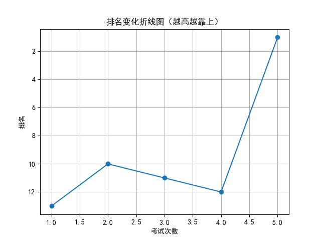

# 📄 学生考试报告：赵可馨
## 基本信息
- 学号：2024012
- 班级：高三 5班
- 性别：女
- 考试编号：第二学期 第五次考试
- 当前总分：139，当前排名：第1名
- 与上次相比，排名↑11名（从第12名到第1名），与第一次考试相比↑12名（从第13名到第1名）

## 错误题目与知识点
- 题目 16：导数的几何意义，由函数的极值求参数的取值范围
- 题目 17：余弦定理，线面垂直的判定与性质，二面角

## 历史分数与排名变化

## 💬 学习建议（由 AI 生成）
赵可馨同学，本次考试你取得了139分、排名1的优异成绩，较之前有明显进步，值得表扬！但还需注意导数几何意义、函数极值与参数范围、余弦定理及立体几何中线面垂直和二面角等知识点。建议针对薄弱点进行专项训练，加强综合题型的解题思路梳理，巩固基础，提升应变能力。继续加油，相信你会更上一层楼！
