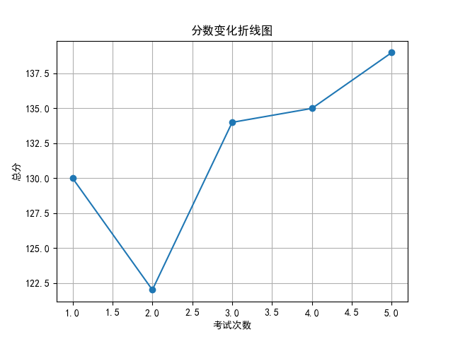
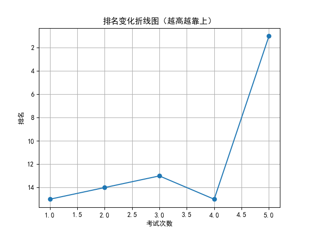

# 📄 学生考试报告：徐梓涵
## 基本信息
- 学号：2024013
- 班级：高三 5班
- 性别：女
- 考试编号：第二学期 第五次考试
- 当前总分：139，当前排名：第1名
- 与上次相比，排名↑14名（从第15名到第1名），与第一次考试相比↑14名（从第15名到第1名）

## 错误题目与知识点
- 题目 16：导数的几何意义，由函数的极值求参数的取值范围
- 题目 17：余弦定理，线面垂直的判定与性质，二面角

## 历史分数与排名变化

## 💬 学习建议（由 AI 生成）
徐梓涵同学，本次考试取得139分、班级第一名的优异成绩，进步显著，值得表扬！但仍需关注导数几何意义、极值参数范围、余弦定理及立体几何相关知识点。建议针对历史与本次错题进行系统归纳，强化薄弱环节训练，巩固提升综合应用能力。继续加油，期待你更出色的表现！
