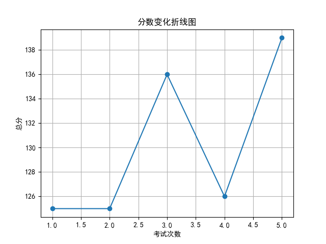
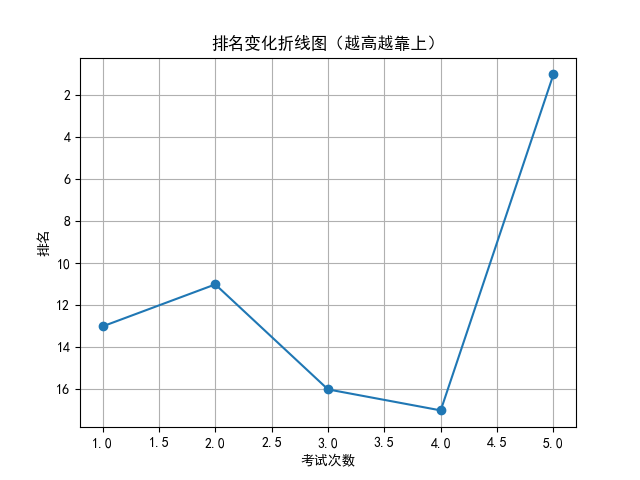

# 📄 学生考试报告：赵子轩
## 基本信息
- 学号：2024014
- 班级：高三 5班
- 性别：男
- 考试编号：第二学期 第五次考试
- 当前总分：139，当前排名：第1名
- 与上次相比，排名↑16名（从第17名到第1名），与第一次考试相比↑12名（从第13名到第1名）

## 错误题目与知识点
- 题目 16：导数的几何意义，由函数的极值求参数的取值范围
- 题目 17：余弦定理，线面垂直的判定与性质，二面角

## 历史分数与排名变化

## 💬 学习建议（由 AI 生成）
赵子轩同学，本次考试成绩139分，排名跃升至第1名，进步显著，值得表扬！你在导数、立体几何等方面仍有薄弱点，如导数的几何意义、余弦定理及二面角等。建议针对历史错题进行系统梳理，强化易错知识点的巩固训练。继续保持专注与努力，相信你会更上一层楼！
