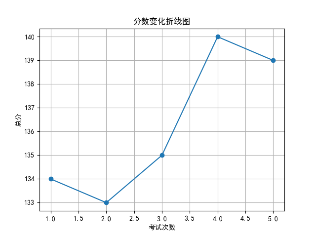
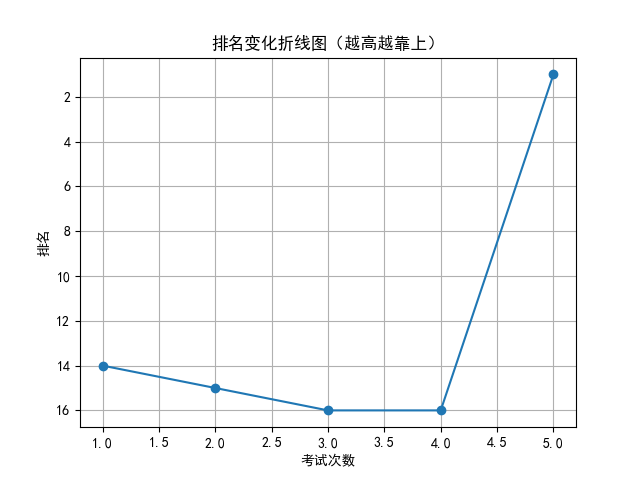

# 📄 学生考试报告：杨依诺
## 基本信息
- 学号：2024015
- 班级：高三 5班
- 性别：女
- 考试编号：第二学期 第五次考试
- 当前总分：139，当前排名：第1名
- 与上次相比，排名↑15名（从第16名到第1名），与第一次考试相比↑13名（从第14名到第1名）

## 错误题目与知识点
- 题目 16：导数的几何意义，由函数的极值求参数的取值范围
- 题目 17：余弦定理，线面垂直的判定与性质，二面角

## 历史分数与排名变化

## 💬 学习建议（由 AI 生成）
杨依诺同学，本次考试你以139分跃居第一，进步显著，值得表扬！你在导数、立体几何等难点上表现突出。但仍有提升空间，如导数极值与参数关系、余弦定理及二面角的掌握仍需巩固。建议针对历史易错点进行系统复习，强化公式推导和解题步骤训练，保持稳定发挥。继续加油，未来可期！
