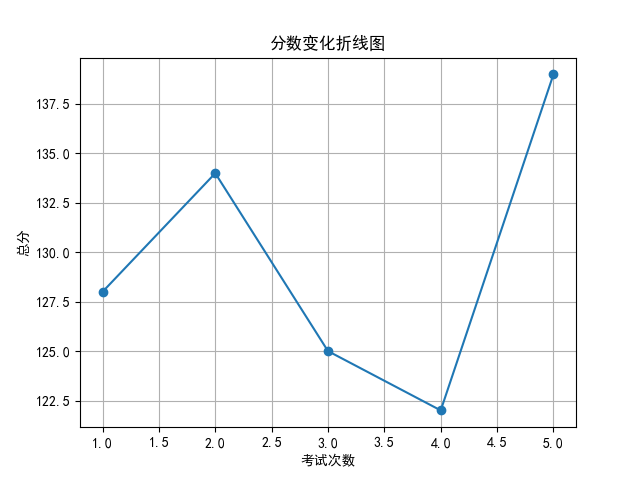
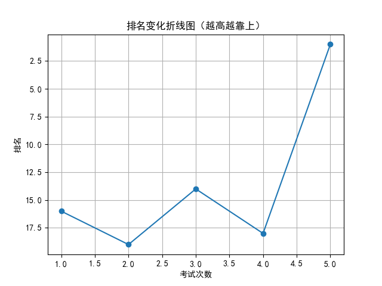

# 📄 学生考试报告：李欣怡
## 基本信息
- 学号：2024016
- 班级：高三 5班
- 性别：女
- 考试编号：第二学期 第五次考试
- 当前总分：139，当前排名：第1名
- 与上次相比，排名↑17名（从第18名到第1名），与第一次考试相比↑15名（从第16名到第1名）

## 错误题目与知识点
- 题目 16：导数的几何意义，由函数的极值求参数的取值范围
- 题目 17：余弦定理，线面垂直的判定与性质，二面角

## 历史分数与排名变化

## 💬 学习建议（由 AI 生成）
李欣怡同学，本次考试取得139分、排名跃居第一，进步显著，值得表扬！你在导数、立体几何等难点上表现突出。但仍有提升空间，如导数与极值、余弦定理、线面垂直及二面角的理解仍需巩固。建议针对薄弱知识点进行专项训练，强化逻辑推理能力。继续保持积极态度，稳步提升成绩！
