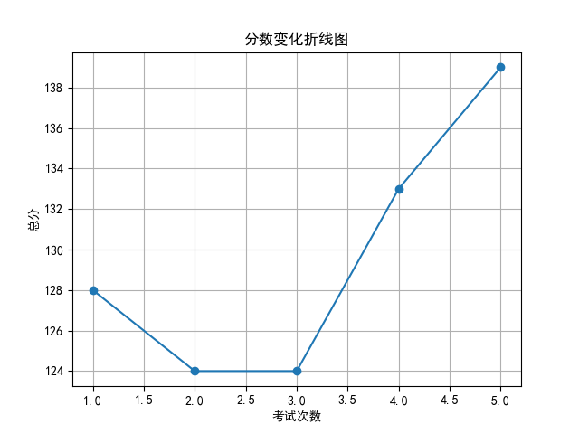
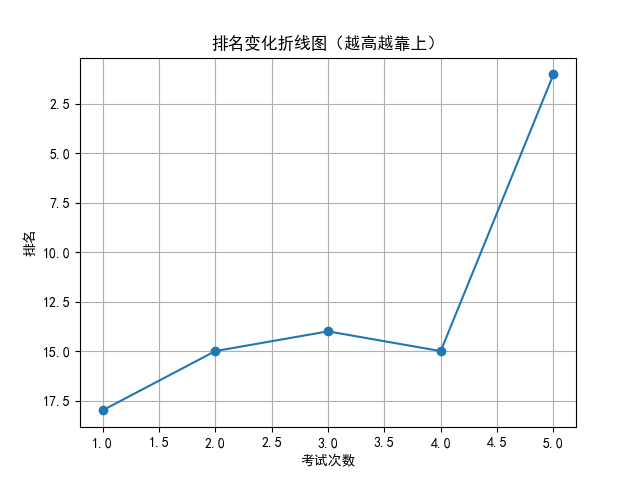

# 📄 学生考试报告：胡佳怡
## 基本信息
- 学号：2024017
- 班级：高三 5班
- 性别：女
- 考试编号：第二学期 第五次考试
- 当前总分：139，当前排名：第1名
- 与上次相比，排名↑14名（从第15名到第1名），与第一次考试相比↑17名（从第18名到第1名）

## 错误题目与知识点
- 题目 16：导数的几何意义，由函数的极值求参数的取值范围
- 题目 17：余弦定理，线面垂直的判定与性质，二面角

## 历史分数与排名变化

## 💬 学习建议（由 AI 生成）
胡佳怡同学，本次考试你取得了139分的优异成绩，首次跃居班级第一，进步显著，值得表扬！你在导数、几何和三角函数等知识点上表现突出。但还需加强对导数与极值参数关系、余弦定理及二面角的理解与应用。建议针对薄弱点进行专项训练，巩固基础，提升综合运用能力。继续努力，相信你会更上一层楼！
