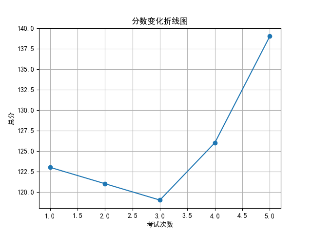

# 📄 学生考试报告：罗诗涵
## 基本信息
- 学号：2024018
- 班级：高三 5班
- 性别：女
- 考试编号：第二学期 第五次考试
- 当前总分：139，当前排名：第1名
- 与上次相比，排名↑19名（从第20名到第1名），与第一次考试相比↑18名（从第19名到第1名）

## 错误题目与知识点
- 题目 16：导数的几何意义，由函数的极值求参数的取值范围
- 题目 17：余弦定理，线面垂直的判定与性质，二面角

## 历史分数与排名变化

## 💬 学习建议（由 AI 生成）
罗诗涵同学，本次考试成绩139分，排名跃升至第一，进步显著，值得表扬！从错误知识点看，导数几何意义、极值参数范围、余弦定理及立体几何仍是薄弱点。建议加强典型例题训练，注重公式推导与图形结合理解。继续保持认真态度，查漏补缺，争取更大突破！
