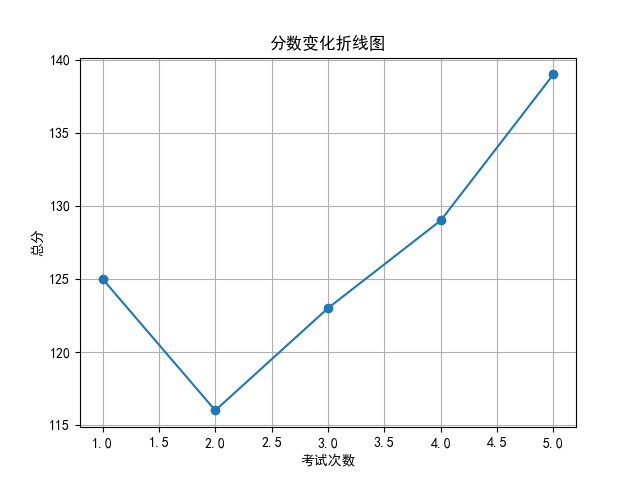
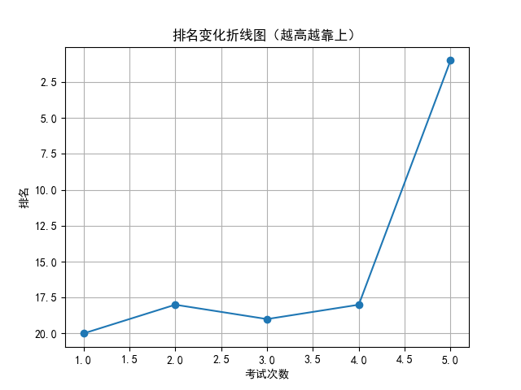

# 📄 学生考试报告：林诗涵
## 基本信息
- 学号：2024019
- 班级：高三 5班
- 性别：女
- 考试编号：第二学期 第五次考试
- 当前总分：139，当前排名：第1名
- 与上次相比，排名↑17名（从第18名到第1名），与第一次考试相比↑19名（从第20名到第1名）

## 错误题目与知识点
- 题目 16：导数的几何意义，由函数的极值求参数的取值范围
- 题目 17：余弦定理，线面垂直的判定与性质，二面角

## 历史分数与排名变化

## 💬 学习建议（由 AI 生成）
林诗涵同学，本次考试取得139分、年级第一的优异成绩，进步显著，值得表扬！你在导数、立体几何等难点上表现突出。但需注意：导数的几何意义、由极值求参数范围、余弦定理及二面角等问题仍存在失误。建议针对历史与本次错题进行专题巩固，强化解题规范与细节处理能力，继续保持良好状态，争取更进一步！
