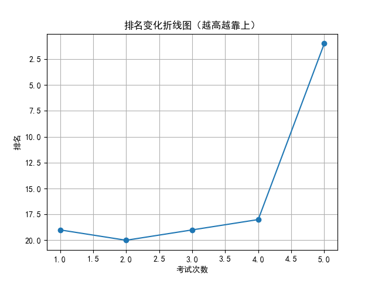

# 📄 学生考试报告：周可馨
## 基本信息
- 学号：2024020
- 班级：高三 5班
- 性别：女
- 考试编号：第二学期 第五次考试
- 当前总分：139，当前排名：第1名
- 与上次相比，排名↑17名（从第18名到第1名），与第一次考试相比↑18名（从第19名到第1名）

## 错误题目与知识点
- 题目 16：导数的几何意义，由函数的极值求参数的取值范围
- 题目 17：余弦定理，线面垂直的判定与性质，二面角

## 历史分数与排名变化

## 💬 学习建议（由 AI 生成）
周可馨同学，本次考试成绩139分、排名跃居第一，进步显著，值得表扬！你对导数与立体几何等难点的理解明显提升。但需注意导数的极值求参、余弦定理及二面角等知识点仍存在问题。建议加强典型题训练，注重解题步骤的规范性，查漏补缺，巩固薄弱环节，争取更大突破！
